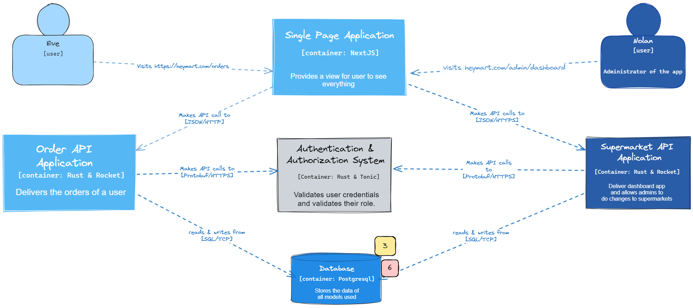

# C4 Model of The Current Architecture

Context Diagram

Container Diagram

Deployment Diagram

# Risk Storming
Hasil dikusi antara Juan Dharmananda Khusuma dan Maurice Yang dari kelompok C15

## Future Architecture

## Identification

Risk matrix

## Consenssus

1. Dua partisipan mendapati bahwa masalah keamanan kredensial database merupakan risiko yang paling tinggi namun kemungkinan terjadinya kecil (3).

2. Dua partisipan mendapati terdapat kesulitan dalam manajemen migrasi schema database akibat arsitektur microservice, namun seluruh microservice hanya menggunakan satu database (6).

## Mitigations
Arsitektur diperbaharui agar setiap microservice menggunakan database tersendiri yangt terisolasi dari database microservice lainya.
Kelebihan:
- Mempermudah manajemen migrasi schema database
- Meminimalisir risiko keamanan kredensial database

Kekurangan:
- Memerlukan biaya tambahan untuk pengelolaan database
- Perlunya pengecekan referential integrity antar database

# Individu 
Component Diagram

Code Diagram
